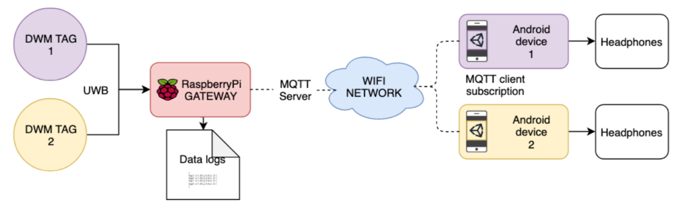
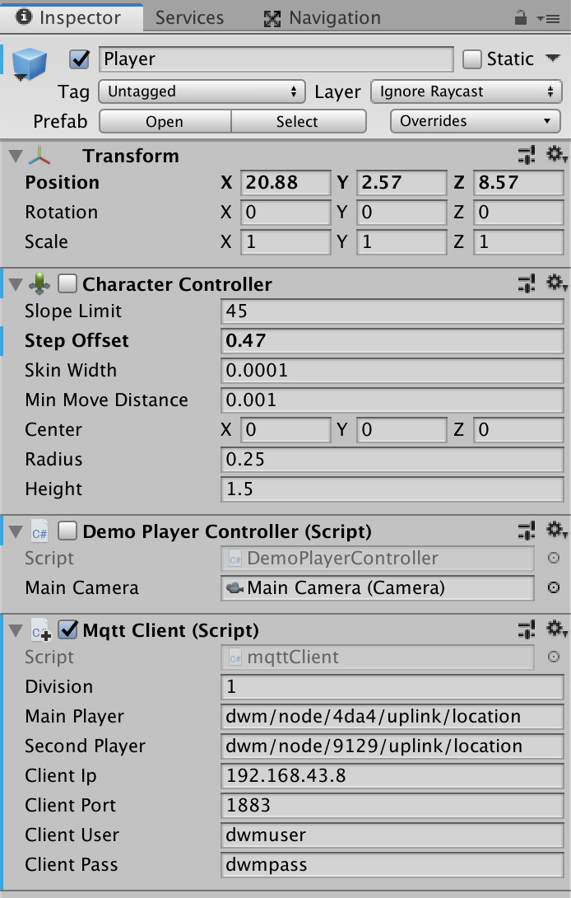

# decawave-unity-greenscape

Tags: #mixed-reality #augmented-reality #DWM1001 #spatial-sound

## What is the project about?

Greenscape is an interactive installation located in mixed reality space that is facilitating an experience of exploration of an augmented reality soundscape of Karolinelund park in Aalborg, Denmark. The user is walking through space encouraged to discover a wide range of sound elements located in the audio augmented reality soundscape.
User can experience an auditory illusion of a different sound sources within the physical and digital space, which are temporally blended together. The sounds change in volume and stereo positioning depending on the user’s real-life location and head orientation within the space.

## How does that work?

This repository aims to demonstrate the connection between [MDEK1001](https://www.decawave.com/product/mdek1001-deployment-kit/) and Unity over network through MQTT protocol. Decawave's system can calculate X, Y, Z position of the tags with around 10 cm of accuracy. We use this positional system in Unity virtual environment, where we designed different sound sources with 3D spatial properties. Their location is carefully aligned with the specific physical location to create a mixed reality spatial sound experience.
This project also try to provide an example of using such technology together with smartphone devices running Android to present the sound binaurally over headphones and achieve appropriate mobility.

We are using Unity v 2019.1.0f2 to build the app for smartphones, taking advantage of their computational power for quality audio processing and build-in orentation sensor. We use this together with [Resonance Audio](https://resonance-audio.github.io/resonance-audio/) to provide a proper stereo panning suitable for experiencing the three-dimensional sound installation.

_Diagram of the system_

## Installation
1. Follow _Gateway Quick Deployment Guide_ which is a part of DWM1001, DW10001-DEV and MDEK1001 Documents under [Product Documentation of MDEK1001 Development kit](https://www.decawave.com/product/mdek1001-deployment-kit/) to gather data about the all DWM tags and share them over network through MQTT protocol. Don't forget to set up network for Raspberry with _wpa_supplicant.conf_ described in the guide.

_Gateway: R3B plus one of the DWM1001 development board_

2. Follow [MDEK1001 Quick Start Guide](https://www.decawave.com/mdek1001/quickstart/) to create a DRTLS network
3. To receive MQTT data in Unity, the clients and Raspberry Pi needs to be connected to the same network. Mqtt Client script need to be adjusted to the IP address corresponding to IP address of Raspberry pi on our network, MQTT username and password defined during our Gatewave installation, and topics we want to subscribe (in this case we care only about the tags and their location).

_Mqtt Client script process data coming from DWM1001 gateway which is attached to the Player game object._

The _Main Player_ represents the main camera view. If we want to run multiple players on multiple app instances, we need to build another app with the different tag for the _Main Player_, or provide some interface for switching between the MQTT tag subscription.
4. Build the app for Android
5. Connect Android phone to the same network

